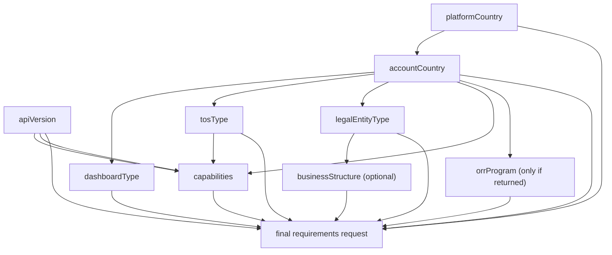

## Instructions

The human-accessible version of this documentation allows the user to select connected account fields and regions using a form, and then makes API requests to fetch and display the requirements a connected account with the selected configuration and region must provide. Follow these instructions to fetch the same information.

### Interaction contract

Terminology used in this document:

- `field`: a setup input such as `platformCountry`, `accountCountry`, or `capabilities`
- `option`: a presented selectable option for a field
- `value`: the option the user selects, or the free-response value the user provides for a field

Every time you ask the user to provide a value for a field:

- use a multiple-choice question; never stop at a plain free-form prompt or wait for raw chat input
- if you need free user input, instruct the user to use the question’s free-response field
- for long option lists, explicitly say that any value from the full validated list is still accepted through the free-response field
- if the user already provided a valid answer in an earlier message, use that instead of asking again

### Hard rules

You must follow these rules:

- Ask for a field *only* after all of its prerequisite fields are satisfied.
- Collect setup fields progressively as the flow advances.
- Ask for one field at a time, or one group of fields only when they are dependency-free at that point in the flow.
  - For example, ask for `platformCountry` and `accountCountry` separately: the platform country determines which account countries are valid, so asking both together can produce invalid combinations. But you may ask for `dashboardType`, `tosType`, and `legalEntityType` together in one group because their valid options are already known from the same response.
- If there is ever a conflict between the user’s request and the validated setup, inform the user of the conflict and ask them to revise their setup choices using the [Interaction contract](#interaction-contract). Keep the validated setup aligned with what the user requested without silently dropping the conflict.
- Follow the [Interaction contract](#interaction-contract) for every user question.
- When the number of available options exceeds four, *always* print the full validated reference list before asking the multiple-choice question so the user can see the full option space.
  - When printing countries, always print the full country name followed by its code in parentheses, for example, `Germany (DE)`.
  - In the multiple-choice question, include a small set of suggested options so the user can move forward with immediate clarity. The reference list above remains the authoritative full set.
  - Leave the descriptions for the country suggested options blank.
- For any field with four or fewer valid options, show every valid option directly in the multiple-choice question. Do not print a separate reference list first.
- Every list of selectable options shown to the user must be pre-validated against all currently known constraints before you display it.
- Never display an option as selectable if you already know it will be removed, rejected, or auto-adjusted later in the flow.
  - Present options that stay valid through the current flow.
- Ask about `capabilities` after `platformCountry`, `accountCountry`, and the downstream validity constraints for that setup are resolved.
- *Only* ask about `orrProgram` when it is present in the public `programs` returned for the validated setup.
- If the `businessStructure` map for the chosen `legalEntityType` is empty or contains exactly one key `nil`, skip `businessStructure`. Otherwise, ask for `businessStructure` and always allow a `none` option or leave unselected as a suggested option in the multiple-choice question.
- If the user decides to change an earlier choice like `platformCountry`, you must invalidate and re-check all downstream fields before continuing.
- Keep the dependency chain implicit. Share the information the user needs to make progress and keep the experience simple.
- Use external-facing language when talking to the user. See below to translate the internal API terminology.

#### Internal fields -> External language

| Internal field | External language |
| --- | --- |
| `apiVersion` | Accounts API version |
| `platformCountry` | Platform country |
| `accountCountry` | Account country |
| `dashboardType` | Dashboard type |
| `tosType` | Service agreement |
| `legalEntityType` | Business type |
| `businessStructure` | Business structure |
| `capabilities` | Capabilities |
| `orrProgram` | Requirements update |
| `eu2025` | Europe |

### Dependency chain

You must follow this dependency chain exactly:



Interpret the diagram literally:

- Ask for a node *only* after all of its incoming dependencies are resolved.
- Always ask the user for `apiVersion` first. Recommend `v2` by default.

### Inputs you eventually need

By the time you make the final requirements request, you must have validated values for all of the following fields:

- `apiVersion`: `v1` or `v2`
- `platformCountry`
- `accountCountry`
- `dashboardType`
- `tosType`
- `legalEntityType`
- `capabilities`: at least one capability must be selected

You also must have asked for the following optional fields, if they’re applicable:

- `businessStructure`: ask only when `legalEntityType` is not `individual`
- `orrProgram`: ask only when present in the public `programs` list for that validated setup

### Resolve capabilities

Use this algorithm whenever you build or validate the capability list:

1. Start from `country_map[accountCountry].capabilities`.
2. Apply `tosType` rules:
   - if `tosType=recipient`, force `transfers` and remove all other capabilities except `crypto_transfers`, which may be available in rare cases
   - if `apiVersion=v1` and `crypto_transfers` is selected, also include `transfers`
3. If `apiVersion=v2`, drop any capability not present in `get-v2-supported-v1-capabilities`.
4. Show the user the filtered capability list. When the user explicitly asks about a filtered-out capability, clearly explain that the asked-for capability is unavailable for the current setup.
5. If the filtered list is empty, tell the user that no capabilities are supported for the current setup and ask them to revise earlier setup choices using the [Interaction contract](#interaction-contract) before making the final requirements request.
6. When asking about `capabilities`, print the full filtered list first, then ask a multiple-choice question that includes the most likely choice or choices based on prior user context.
7. If the user asks for a capability outside the filtered list, explain why it is unavailable for the current setup.

- Keep the user’s requested capability visible in the conversation and explain the incompatibility directly. For example, if the user asks for `paypal_payments`, but also selected `v2` accounts, explain that `paypal_payments` is unavailable for `v2` accounts, and offer them the choice of switching to `apiVersion` `v1` and choosing `paypal_payments`, or remaining with `apiVersion` `v2` and choosing a different capability.

### Agent flow

When the user asks what verification information they need, use this flow:

1. Ask for `apiVersion`. Recommend `v2`.
2. Fetch `https://docs.stripe.com/_endpoint/get-platform-countries` and use the public supported list to ask for `platformCountry`.
3. Fetch `https://docs.stripe.com/_endpoint/get-v2-supported-v1-capabilities` if `apiVersion=v2`.
4. Fetch `https://docs.stripe.com/_endpoint/get-requirement-selections-for-platform-country?platformCountry=...` with the chosen `platformCountry`.
5. Ask for `accountCountry` from the returned `country_map` keys.
6. After `accountCountry` is validated, ask for:
   - `dashboardType`
   - `tosType`
   - `legalEntityType`
7. After `legalEntityType` is chosen, ask for `businessStructure` if the validated structure map exposes it.
8. Resolve and ask for `capabilities` using [Resolve capabilities](#resolve-capabilities).
9. Ask for `orrProgram` only if the validated setup exposes one or more public programs.
10. If the user’s requested setup doesn’t match the valid options, tell them exactly which parts are invalid or auto-adjusted, then ask the correcting follow-up using the [Interaction contract](#interaction-contract). Keep the mismatch visible, keep the setup grounded in the user’s request, and continue with a structured follow-up question.
11. Only after the setup is valid, call `https://docs.stripe.com/_endpoint/get-requirements-for-setups` with one top-level setup key `account-setup-A[...]`, including `account-setup-A[apiVersion]`, `account-setup-A[platformCountry]`, `account-setup-A[accountCountry]`, `account-setup-A[dashboardType]`, `account-setup-A[tosType]`, `account-setup-A[legalEntityType]`, optional `account-setup-A[businessStructure]`, one or more `account-setup-A[capabilities][i]`, and optional `account-setup-A[orrProgram]`.
12. At the end, you must call `https://docs.stripe.com/_endpoint/get-website-requirements-for-capabilities?capabilities[i]=...` and `https://docs.stripe.com/_endpoint/get-mcc-restrictions-for-capabilities?capabilities[i]=...` with the final validated capabilities to check for additional information.

If you are asked to compare two setups or are asked what is needed to update from X to Y, you must follow the validation flow for setup A with a top-level `account-setup-A[...]` key and then follow the flow again for setup B with a second top-level key `account-setup-B[...]` before calling the diffable requirements request.

Treat transport or build failures as retryable helper failures, and reserve unsupported-setup conclusions for successful prerequisite fetches and business validation results.

### curl examples

In these examples, set the docs host to the public site:

```bash
DOCS_HOST="https://docs.stripe.com"
```

#### Naive user: “What do I need to verify for a Stripe connected account?”

Ask for `apiVersion`. Recommend `v2`.

Fetch the public platform-country list:

```bash
curl --get "$DOCS_HOST/_endpoint/get-platform-countries"
```

Ask the user which `platformCountry` value they want to use. Then, fetch the allowed options for that platform country. This request tells you what is valid next, and you must use it before choosing downstream fields. For example, if the user chose `US`:

```bash
curl --get "$DOCS_HOST/_endpoint/get-requirement-selections-for-platform-country" \
  --data-urlencode "platformCountry=US"
```

After that response returns, collect setup choices as described in the [Agent flow](#agent-flow) section.

#### Smart user: “I have a CA platform, and I want to onboard a FR company connected account to use card payments”

Ask for `apiVersion`. Recommend `v2`.

```bash
# Step 1: verify the platform country is valid
curl --get "$DOCS_HOST/_endpoint/get-platform-countries"

# Step 2: fetch all public options for that platform country
curl --get "$DOCS_HOST/_endpoint/get-requirement-selections-for-platform-country" \
  --data-urlencode "platformCountry=CA"
```

From that second response, first verify that FR is a valid account country, then read:

- `country_map.FR.dashboard_types`
- `country_map.FR.tos_types`
- `country_map.FR.entity_type_structures`
- `country_map.FR.capabilities`
- `country_map.FR.programs`

Then, confirm the user’s requested setup actually matches those available options.

If the user wants `apiVersion=v2`, first fetch and apply the v2 capability filter to compare against the user’s requested capabilities:

```bash
curl --get "$DOCS_HOST/_endpoint/get-v2-supported-v1-capabilities"
```

Only when the user’s requested setup actually matches those available options, then call the requirements endpoint.

The requirements endpoint expects nested query-string fields, not a JSON body:

```bash
curl --get "$DOCS_HOST/_endpoint/get-requirements-for-setups" \
  --data-urlencode "account-setup-A[apiVersion]=v2" \
  --data-urlencode "account-setup-A[platformCountry]=CA" \
  --data-urlencode "account-setup-A[accountCountry]=FR" \
  --data-urlencode "account-setup-A[dashboardType]=none" \
  --data-urlencode "account-setup-A[tosType]=full" \
  --data-urlencode "account-setup-A[legalEntityType]=company" \
  --data-urlencode "account-setup-A[businessStructure]=corporation" \
  --data-urlencode "account-setup-A[capabilities][0]=card_payments"
```

Optionally, since `.programs` is present for this configuration, you can ask the user if they would like to choose a requirements update and add `--data-urlencode "account-setup-A[orrProgram]=eu-2025"` to the request.

Use this response to present the requirements to the user as explained in the [Construct the result](#construct-the-result) section.

Fetch the optional supplemental tables for the selected capabilities:

```bash
curl --get "$DOCS_HOST/_endpoint/get-website-requirements-for-capabilities" \
  --data-urlencode "capabilities[0]=card_payments"
```

```bash
curl --get "$DOCS_HOST/_endpoint/get-mcc-restrictions-for-capabilities" \
  --data-urlencode "capabilities[0]=card_payments"
```

### Read the API responses

Use `get-platform-countries` to choose your initial `platformCountry`:

- `platform_countries` is the public list of available `platformCountry` options
- `default_country` is the page’s default starting country

Use `get-requirement-selections-for-platform-country` to validate the setup before you call the main requirements endpoint:

- `country_map` is the source of truth for which field values are valid for that `platformCountry` value
- the keys of `country_map` are the allowed `accountCountry` options
- `country_map[ACCOUNT_COUNTRY].dashboard_types` constrains `dashboardType`
- `country_map[ACCOUNT_COUNTRY].tos_types` constrains `tosType`
- `country_map[ACCOUNT_COUNTRY].entity_type_structures` constrains `legalEntityType` and optional `businessStructure`
- `country_map[ACCOUNT_COUNTRY].capabilities` constrains capability choices
- `country_map[ACCOUNT_COUNTRY].programs` lists the only public ORR programs you may pass as `orrProgram`
- `external_country_map` should be ignored

Apply these dependency rules before making the final request:

- if you change `accountCountry`, re-check all downstream selections
- if you change `legalEntityType`, re-check `businessStructure` and all downstream selections
- if you change `accountCountry`, `tosType`, or `apiVersion`, re-run [Resolve capabilities](#resolve-capabilities)

Use `get-requirements-for-setups` as your main source of requirement data:

- `requirements` contains the successful result for each requested setup key
- `validation_errors` means the setup was invalid and must be corrected before you interpret the response
- `build_errors` means the endpoint failed unexpectedly while building the summary; you must treat this as retryable rather than as a business conclusion

Within each successful setup result:

- `requirements[field_name]` is the requirement data for a single raw field, including enforcement limits, alternatives, display metadata, and related annotations used by the docs renderer
- `extras` contains human-readable labels and validation guidance for that requirement
- `requirement_tags` contains top-level requirement tags returned alongside the requirements data
- `requirement_groups` contains grouped requirement data returned alongside the requirements data

Check the supplemental endpoints to see if there are any additional capability-specific restrictions to present to the user.

- `requirements_by_capability` from the website endpoint is a separate website requirements table that explains requirements the connected account’s website must meet to support the selected capability. These should be presented to the user as a separate table.
- `restrictions_by_capability` from the MCC endpoint is a separate MCC restrictions table that explains requirements the connected account’s MCC must meet to support the selected capability. If this endpoint returns any restrictions, ask the user what kind of business they are running to determine whether their business type is prohibited or restricted from using the specific capability.
- Empty maps are valid results for many standard capabilities and are not necessarily errors.

### Construct the result

Transform the API response into one or more human-readable tables in your own reply to the user, followed by any additional explanatory notes. These are output tables that you construct from the response data, not references to pre-existing tables on the human docs page.

##### How to construct the tables:

1. Split each raw field key into a section using its prefix:
   - `company.*` -> `company`
   - `documents.*` -> `documents`
   - `individual.*` -> `individual`
   - `representative.*` -> `representative`
   - `directors.*` -> `directors`
   - `owners.*` -> `owners`
   - `executives.*` -> `executives`
   - anything else -> `account`
2. Render one table per non-empty section. Do not merge multiple sections into one table.
3. For each table:
   - use the capitalized section name as the table heading, for example `Account`, `Company`, `Representative`, `Directors`, or `Owners`
   - Include the following columns:
     - Heading: blank
       - Content: Row display name, for example “Name”, “Date of birth”, or “Address”
     - Heading: `Requirement`
       - Content: a bulleted list of displayed fields
       - Render one bullet per displayed field
       - Render each field in code format
       - If a field has alternatives, keep them in the same bullet and render them as a set of options, for example ``field_a` or `field_b``
     - Heading: `Verification`
       - Content: a bulleted list built from `extras[].value`
       - Render each `extras[].value` entry as one list item
       - If `extras` is empty, leave the entry blank
     - Heading: `Enforcement action`
       - Content: human-readable enforcement text built from both sets of limit fields
       - First use the unverified limit fields to generate the `if not provided` message(s):
         - `capability_limit_amount`
         - `capability_limit_time`
         - `payment_limit_amount`
         - `payment_limit_time`
         - `payout_limit_amount`
         - `payout_limit_time`
       - Then use the verified limit fields to generate the `if not verified` message(s):
         - `verified_capability_limit_amount`
         - `verified_capability_limit_time`
         - `verified_payment_limit_amount`
         - `verified_payment_limit_time`
         - `verified_payout_limit_amount`
         - `verified_payout_limit_time`
       - If any limit amount or limit time is `<= 0`, treat that impact as immediate
       - If both a time limit and an amount limit exist for the same impact, join them with `or`
       - Group impacts with identical thresholds into a single sentence, for example `Capability, payments, and payouts will be paused immediately if not provided.`
       - If both `if not provided` and `if not verified` text exist, render the `if not provided` sentence(s) first and then the `if not verified` sentence(s); prefix the first `if not verified` sentence with `Also,`
       - If neither set of limits is present, render `—`
4. If two sections share the same row-definition family, they still remain separate tables. For example, `representative` and `owners` both use the `person` row-definition family, but they render as separate `Representative` and `Owners` tables because they are different sections.
5. Assign each section to one of the row-definition families listed below in the `Row definitions` step. The row-definition family only controls how rows are matched and labeled inside that section’s table:
   - `account` -> `account`
   - `company` -> `entity`
   - `documents` -> `entity`
   - `individual` -> `person`
   - `representative` -> `person`
   - `owners` -> `person`
   - `executives` -> `person`
   - `directors` -> `person`
6. For every non-`account` section, strip the section prefix before matching row rules. For example, match `representative.first_name` as `first_name` and `company.address.city` as `address.city`.
7. Use the row definitions below for that section’s row-definition family. Create a row only when at least one field in that section matches the row.
8. Row definitions:

account: Merchant category code: `/business_profile.mcc/` URL: `/business_profile.(url|requirement)/` Product description: `/business_profile.product_description/` Support phone: `/business_profile.support_phone/` Statement descriptors: `/settings.payments.statement_descriptor/`

- /settings.card_payments.statement_descriptor/ Konbini support email address: `/settings.konbini_payments.support_email/` Konbini support phone number: `/settings.konbini_payments.support_phone/` Konbini support hours: `/settings.konbini_payments.support_hours/` Terms of service: `/^tos_acceptance\./` Issuing terms of service: `/settings\.card_issuing\.tos_acceptance\./` Estimated worker count: `/business_profile\.estimated_worker_count/` Annual revenue: `/business_profile\.annual_revenue/` External account: `/external_account/` Legal guardian: `/legal_guardian\./`

entity: Company name: `/name$/` Company name (kana): `/name_kana/` Company name (kanji): `/name_kanji/` Company address: `/address\..*/` Company address (kana): `/address_kana/` Company address (kanji): `/address_kanji/` Company phone: `/phone/` Company tax ID: `/tax_id/` Company registration number: `/registration_number/` Company ID number: `/id_number/` Trade license: `/company_license/` Memorandum of Association: `/company_memorandum_of_association/` Proof of bank account: `/bank_account_ownership_verification/` Directors provided: `/directors_provided/` Owners provided: `/owners_provided/` Executives provided: `/executives_provided/`

person: Name: `/(first|last)_name/` Name (kana): `/(first|last)_name_kana/` Name (kanji): `/(first|last)_name_kanji/` Aliases: `/full_name_aliases/` Date of birth: `/dob\./` Address: `/^address\./` Address (kana): `/address_kana/` Address (kanji): `/address_kanji/` Registered address: `/registered_address/` Email: `/email/` Phone: `/phone/` Gender: `/gender/` Political Exposure: `/political_exposure/` Tax information: `/ssn_last_4$/` or `/id_number$/` Secondary ID number: `/(id_number_secondary)/` Job title: `/(relationship\.title)/` Relationship with legal entity: `/relationship\.(?!title)/` Nationality: `/nationality/` Passport: `/passport/` Proof of liveness: `/proof_of_liveness/`

1. For `apiVersion=v2`, replace each displayed field with `v2_field_name` and use `v2_alternatives`.
2. If `apiVersion=v2` and a requirement doesn’t expose `v2_field_name`, omit that field from the rendered table. If that removes every field from a row group, omit the row. If a section becomes empty, omit that section table.

##### How to construct the JSON-style summary:

- if the user asks for a JSON summary of required items, return a JSON object in this exact shape. Each array holds zero or more field names:
  ```json
  {
    "requirements": {
      "currently_due": [
        "configuration.merchant.mcc",
        "company.name",
        "representative.first_name"
      ],
      "eventually_due": [
        "business_profile.url"
      ]
    }
  }
  ```
Do not use ellipses (`...`) or placeholder strings in the output — list every field name explicitly.
- this shape is a derived summary for comparison and display. It is not a raw Accounts API response.
- If `apiVersion=v2`, inform the user that this JSON is for information only, and doesn’t match the shape of a real API response.
- derive each field’s due bucket from the requirement’s limit fields in the `get-requirements-for-setups` response:
  - treat a field as `currently_due` when any unverified limit amount or time is `<= 0`, or any verified limit amount or time is `<= 0`
  - otherwise treat it as `eventually_due`
- populate `requirements.currently_due` and `requirements.eventually_due` from those derived buckets
- do not add a separate `future_requirements` bucket. Regulatory or ORR-driven future changes are modeled through `orrProgram` setup selection and A/B setup comparison, not through a third due array
- for `apiVersion=v1`, use the raw requirement field names in both arrays
- for `apiVersion=v2`, use `v2_field_name` values in both arrays
- If `apiVersion=v2`, omit fields that have no `v2_field_name`
- the JSON diff view compares requirement names only; it doesn’t diff verification text, thresholds, or supplemental metadata

### How to respond to users

When you return results to the user:

- restate the exact validated setup you queried, including `apiVersion`, `platformCountry`, `accountCountry`, `dashboardType`, `tosType`, `legalEntityType`, optional `businessStructure`, selected `capabilities`, and optional `orrProgram`
- always provide the user with a link containing the exact URL query parameters you used so they can view the requirements themselves and verify your conclusions
  - for example: `https://docs.stripe.com/_endpoint/get-requirements-for-setups?account-setup-A[platformCountry]=CA&account-setup-A[accountCountry]=FR&account-setup-A[dashboardType]=full&account-setup-A[tosType]=full&account-setup-A[legalEntityType]=individual&account-setup-A[capabilities][0]=card_payments&account-setup-A[orrProgram]=eu-2025` -> `https://docs.stripe.com/connect/required-verification-information?accountSetupKeys=account-setup-A&account-setup-A%5BapiVersion%5D=v2&account-setup-A%5BplatformCountry%5D=CA&account-setup-A%5BaccountCountry%5D=FR&account-setup-A%5BdashboardType%5D=full&account-setup-A%5BtosType%5D=full&account-setup-A%5BlegalEntityType%5D=individual&account-setup-A%5BbusinessStructure%5D=undefined&account-setup-A%5Bcapabilities%5D=card_payments&account-setup-A%5BorrProgram%5D=eu-2025`
  - when comparing two setups, include `account-setup-B` in the page URL only if you validated and queried setup B
- if any requested choice had to be changed because of selector dependencies, say so explicitly before presenting the requirements
- present currently due requirements separately from eventually due requirements, and label them clearly
- explain verification bullets using `extras[].value` as the source of truth
- mention when a requirement was omitted because it matched none of the table row definitions in this document
- mention when website or MCC endpoints returned no supplemental data, so the user doesn’t mistake that for a fetch failure
- if you receive `validation_errors`, ask the user to correct the setup inputs using the [Interaction contract](#interaction-contract) instead of guessing
- if you receive `build_errors`, retry the request; if the error persists, tell the user the helper endpoint failed unexpectedly
